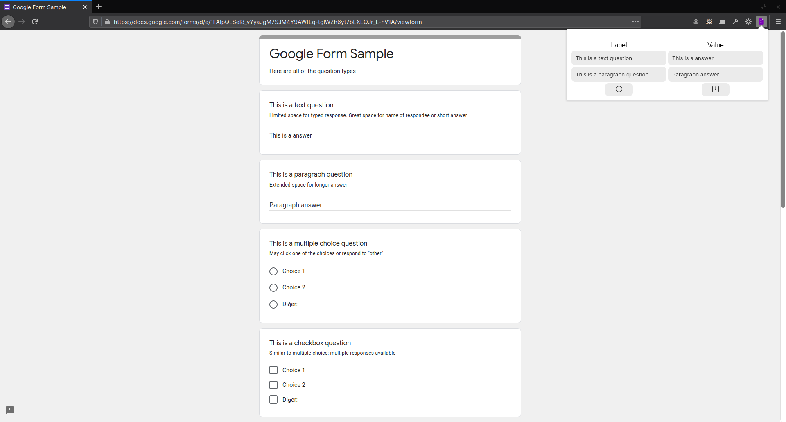

# Google Forms Auto Filler

This add-on enters text into input fields of Google Forms by predefined values automatically. For example if you set *Name* as *John*, each input fields of Google Forms whose title is *Name* gets *John* value when the page is loaded. 

Get it on add-on stores:
+ Firefox: <https://addons.mozilla.org/en-US/firefox/addon/google-forms-auto-filler/>
+ Chrome: Coming soon
+ Opera: Coming soon

### Built

zip -r -FS ../GoogleFormsAutoFiller.zip * --exclude '*.git*' Add-on\ Screenshot.png

### TODO

When save button pressed, run auto filling code with new entries
Add option
Add style to popup window.
Add feature: fill by title-key similarity

https://chrome.google.com/webstore/devconsole
